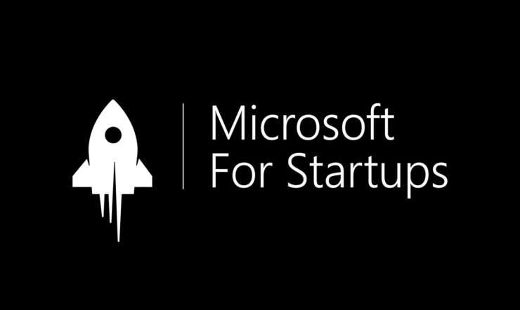

# Microsoft For Startups


<!-- PROJECT LOGO -->
<br />
<div align="center">
  <a href="https://github.com/github_username/repo_name">
    
  </a>

<h3 align="center">Building a startup on Microsoft Azure (S01E03)</h3>

  <p align="center">
    This repo contains all the work for Episode 3 of Nikhil Sehgal's series on building a startup on Microsoft Azure.
    <br />
    <br />
    <!-- <a href="https://nikhilsehgal123-zipit-main-zsarkz.streamlit.app/">View Demo</a> -->

  </p>
</div>

<!-- ABOUT THE PROJECT -->
## About The Project

<!-- [![Product Name Screen Shot][product-screenshot]](https://example.com) -->
***Products Used***
- ```Azure OpenAI```
- ```Azure Speech Services```


***Overview***
To view the presentation please [click here](https://www.canva.com/design/DAFUvXsuH2I/5063PrxJAuW39iOI5GTUaQ/view?utm_content=DAFUvXsuH2I&utm_campaign=designshare&utm_medium=link&utm_source=publishsharelink)

***Solution Brief***
Using Azure OpenAI & Azure Speech Services, we have built a solution we have built a personal AI assistant that can help you with ANYTHING! The assistant can help you with your daily tasks and even help you with your personal life. The assistant is powered by Azure OpenAI and Azure Speech Services.

<!-- Description of each script -->
## Description of each script

- ```main.py``` - This is the main script that runs the entire application.
- ```speech_synthesis.py``` - This script contains all the functions that interact with the Azure Speech Service
- ```azure_openai.py``` - This script contains all the functions that interact with the OpenAI API.
- ```.env``` - This file contains all the environment variables that are used in the application. (This file is not included in the repo for security reasons)*

*Your .env file should contain the following variables:*
```python
OPENAI_API_KEY=<YOUR API KEY>
SPEECH_KEY=<YOUR SPEECH KEY>
SPEECH_REGION=<YOUR SPEECH REGION>
```

<!-- GETTING STARTED -->
## Getting Started

To run the project locally, run the following CLI commands.

```python
pip install -r requirements.txt ## Install all the dependencies
python main.py ## Run the main application
```

<!-- Resources -->
## Learning Resources

- [Azure Cognitive Services](https://azure.microsoft.com/en-us/products/cognitive-services/)
- [Azure OpenAI](https://azure.microsoft.com/en-us/products/cognitive-services/openai-service/)


